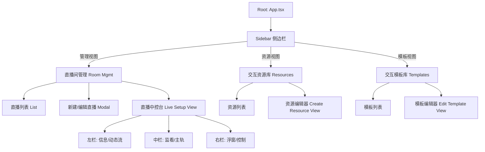

# 直播管理系统产品需求文档 (PRD)

> 如需更完整的模块拆解、字段说明、流程图与状态机，请阅读：[`PRD_详细版.md`](./PRD_详细版.md)

## 1. 文档概述
**项目名称**：直播管理控制台 (Live Admin System)
**版本**：V1.1 (Detailed)
**面向对象**：后端开发、前端开发、QA、产品经理
**最后更新**：2026-01-07

---

## 2. 产品背景与目标
本项目是一个 **B端直播中控台**，主要服务于学校和教育机构。它不像抖音/快手那样面向C端娱乐，而是侧重于 **教学流程的编排** 和 **高密度的互动管理**。

**核心痛点解决**：
1.  **繁琐的OBS操作**：将OBS的场景切换集成到网页端，老师不需要切屏去操作OBS。
2.  **互动形式单一**：提供10+种互动玩法（答题、辩论、3D模型等），超出常规直播的点赞/弹幕。
3.  **流程复用难**：通过“模板”机制，让一堂精心设计的互动课可以无限复用。

---

## 3. 系统架构与角色

### 3.1 用户角色
*   **超级管理员/导播**：负责创建直播间，配置OBS连接，管理资源库和模板库。
*   **讲师/老师**：负责在直播过程中控制流程，触发互动，查看学生反馈。

### 3.2 功能信息架构



---

## 4. 详细功能模块说明

### 4.1 直播间管理模块 (Room Management)
**核心职责**：管理直播场次及其元数据。

#### 4.1.1 直播列表 (`LiveStreamList.tsx`)
*   **展示字段**：封面图、直播标题、讲师姓名、类型标签（课程/普通）、状态标签（未开始/直播中/已结束）。
*   **操作**：
    *   **进入直播**：跳转到“直播中控台”。
    *   **编辑**：弹出模态框修改信息。
    *   **删除**：物理删除直播记录。
    *   **搜索**：支持按名称和讲师搜索。

#### 4.1.2 新建/编辑直播 (`CreateLiveModal.tsx`)
*   **直播类型 (LiveType)**：
    *   **课程直播 (COURSE)**：必须关联具体的“班级”或“课节”。
        *   *逻辑*：多级联动选择器，选择 [年级 -> 班级 -> 课节]。
    *   **普通直播 (ORDINARY)**：通用型直播，需配置“可见范围”。
        *   *可见性维度*：按班级、按课程、按用户类型（如“vip学生”）、按学号ID（精准白名单）。
*   **基础字段**：标题、描述、封面URL、讲师姓名、计划开始时间。
*   **场次管理 (Sessions)**：仅普通直播有效，用于定义直播内的子环节（如“第一场：开场白”，“第二场：颁奖”）。

---

### 4.2 交互资源库模块 (Resource Library)
**核心职责**：生产“乐高积木”式的互动组件单元。
**实现文件**：`CreateInteractiveResourceView.tsx`

#### 4.2.1 资源类型详解
所有资源均需配置：`名称`、`标签`、`对应Category`。

| 类型 | 标识 (Category) | 详细配置字段 (Config JSON) | 业务逻辑说明 |
| :--- | :--- | :--- | :--- |
| **答题** | `QUIZ` | <li>`topic`: 题目名称</li><li>`options`: 选项数组[{name, desc, img}]</li><li>`isSingle`: 是否单选</li><li>`correctAnswer`: 正确选项ID</li><li>`rewardScore`: 奖励分</li> | 基础的互动形式，用于测试学生知识掌握情况。 |
| **辩论** | `DEBATE` | <li>`title`: 辩题</li><li>`pro`: 正方观点 {view, img}</li><li>`con`: 反方观点 {view, img}</li> | 实时红蓝对抗，通常显示双方支持率进度条。 |
| **投票** | `VOTE` | <li>`name`: 投票标题</li><li>`options`: 选项列表</li><li>`isSingle`: 是否单选</li> | 区别于答题，没有对错之分，主要用于调研。 |
| **讨论** | `DISCUSSION` | <li>`topic`: 话题</li><li>`totalTime`: 总时长</li><li>`perPersonTime`:每人限时</li> | 引导学生在讨论区发言，UI通常展示倒计时。 |
| **3D模型** | `MODEL` | <li>`url`: .glb/.gltf 文件地址</li><li>`jsonConfig`: 视角配置</li> | 在学生端渲染交互式3D模型。 |
| **Gandi** | `GANDI_EMBED` | <li>`projectId`: Gandi平台项目ID</li> | 内嵌 iframe，加载外部积木编程作品。 |
| **外链** | `LINK` | <li>`url`: 网页地址</li> | 在浮窗中打开外部网页（如问卷星）。 |
| **一站到底** | `ONE_STAND` | <li>`mode`: 淘汰模式(错误淘汰/最大错误数)</li><li>`questions`: 题目数组</li> | 连续答题闯关，答错即淘汰。 |
| **切片课** | `COURSE_SLICE` | <li>`lessonName`: 关联课节名</li><li>`version`: 版本号</li> | **特殊逻辑**：这是一个“容器”资源。添加时会根据课节配置自动“炸开”成多个子任务（视频、作业等）。 |

---

### 4.3 交互模板库模块 (Templates)
**核心职责**：流程编排。将散落的资源串联成线。
**数据结构**：
*   `InteractionTemplate` 包含一个 `items` 数组。
*   每个 `item` 存储的是 `resourceId` 和该环节的 `time` (相对开始时间的偏移量)。
*   **保存逻辑**：支持将当前直播间配置好的列表另存为新模板。

---

### 4.4 直播中控台核心 (Live Console)
**核心职责**：直播时的操作面板。
**布局**：左-中-右 三栏自适应布局 (`ResizableLayout`)。

#### 4.4.1 左侧栏：动态与信息
1.  **学生时间流 (Student Time Stream)**：
    *   **功能**：模拟/展示学生端产生的实时事件。
    *   **事件类型**：`进入直播`、`发送弹幕`、`提交答题`、`投票`、`Gandi互动`等。
    *   **筛选**：支持按事件类型（如只看答题）、战队（红/蓝队）、学号/姓名搜索过滤。
    *   *开发注意*：目前展示的是 Mock 数据，后续需接入 WebSocket 消息推流。
2.  **基础信息**：只读展示当前直播信息。

#### 4.4.2 中间栏：主监看与主轨道
1.  **视频监看区 (Monitor)**：
    *   **视频源**：调用浏览器 `navigator.mediaDevices.getUserMedia` 获取本地摄像头。
    *   **音频可视化**：使用 `AudioContext` + `AnalyserNode` 绘制实时音量波形。
    *   **全局控制**：
        *   `开始直播` / `停止直播`：切换全局状态。
        *   `直播测试`：进入 Test Mode，仅特定测试账号可见。
2.  **主轨道 (Main Track)**：
    *   **定义**：强干扰、占据屏幕核心区域的内容（如切片课视频、全屏PPT）。
    *   **互斥性**：**同一时间只能有一个主轨道内容被激活**。
    *   **操作**：
        *   `Play`：激活该内容，自动停止当前正在播放的其他主轨道内容。
        *   `Stop`：停止播放。

#### 4.4.3 右侧栏：浮窗轨道与设备控制
1.  **OBS 控制面板 (`LiveStreamControls.tsx`)**：
    *   **连接**：配置 IP/Port/Password 连接 OBS WebSocket (v5)。
    *   **场景列表**：读取 OBS 的 Scene 列表。
    *   **预览与切换**：点击场景名，发送 `SetCurrentProgramScene` 指令切换 OBS 画面。
    *   **画布预览**：简单解析 OBS SceneItem 的 transform 数据，在网页端绘制线框预览图。
2.  **媒体设备控制**：
    *   麦克风选择与静音。
    *   摄像头选择与开关。
    *   **切入模式**：
        *   `全屏切入`：讲师画面全屏。
        *   `画中画切入`：讲师画面缩小悬浮。
3.  **浮窗轨道 (Overlay Track)**：
    *   **定义**：弱干扰、悬浮于视频上层的内容（如答题卡、投票器）。
    *   **并行性**：**支持多个 Overlay 同时存在**（虽通常业务上建议少量）。
    *   **逻辑**：
        *   如果不依附于主轨道，则独立存在。
        *   如果依附于主轨道（`parentId`），则随主轨道内容的开始/结束而联动（可选）。

---

## 5. 关键业务逻辑细节

### 5.1 实例化原理
*   **资源 (Resource)** 是静态的库文件描述。
*   **交互项 (InteractionItem)** 是直播间内的运行时实例。
*   当用户从“资源库”添加一个“答题”到“直播间”时：
    1.  系统生成一个新的 `InteractionItem`。
    2.  生成唯一的 `id` (e.g., `inst-12345`)。
    3.  复制 Resource 的 `config` 到 Item 的 `config`。
    4.  **修改 Item 的 config 不会影响原始 Resource**。

### 5.2 轨道策略 (Track Policy)
在 `types.ts` 中定义了 `TrackType = 'MAIN' | 'OVERLAY'`。
*   **MAIN**: 视频、切片课、PPT。逻辑：**Exclusive (独占)**。激活 A 必先 Kill B。
*   **OVERLAY**: 答题、投票、红包。逻辑：**Parallel (并行)**。可以一边看视频(Main)一边做题(Overlay)。

### 5.3 自动流转 (Auto-Play)
虽然目前主要由手动触发 (`MANUAL`)，但系统预留了 `AUTO_TIME` 模式。
*   **机制**：`LiveSetupView` 内有一个定时器 (`setInterval`)。
*   **判定**：当 `CurrentLiveTime >= Item.time` 且 `Item.triggerMode == AUTO`，自动触发状态变更。

---

## 6. 技术栈与规范

### 6.1 前端技术栈
*   **框架**: React 18 + TypeScript
*   **构建工具**: Vite
*   **样式库**: Tailwind CSS (均使用原子类，避免 css modules)
*   **图标库**: Lucide React
*   **本地数据库**: Dexie.js (IndexedDB wrapper) —— **所有数据优先存本地，模拟后端行为**。

### 6.2 目录结构规范
```
/src
  /components
    /LiveSetupView.tsx       # 中控台主入口
    /LiveStreamControls.tsx  # OBS及媒体硬件控制
    /Create*.tsx             # 各类创建/编辑页
    /*Card.tsx               # 各类互动组件的展示卡片 (如 QuizCard)
  /services
    /db.ts                   # Dexie数据库定义与单例
  /types.ts                  # 全局类型定义 (Interface source of truth)
```

## 7. 附录：数据字典 (Dexie Schema)
*   `streams`: `++id, name, type, status, [sessions]`
*   `resources`: `++id, name, category, [labels]`
*   `templates`: `++id, name, [items]`

---
**开发注意事项**：
1.  修改 `types.ts` 时需谨慎，因为 Dexie 数据库依赖这些接口。
2.  样式上请遵循“大圆角(rounded-2xl)”、“轻阴影(shadow-sm)”、“莫兰迪色系背景”的 Modern Clean 风格。
3.  涉及到 OBS 控制的代码，请做好异常捕获，防止 Socket 断开导致页面崩溃。
