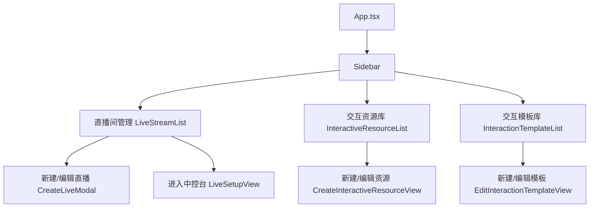
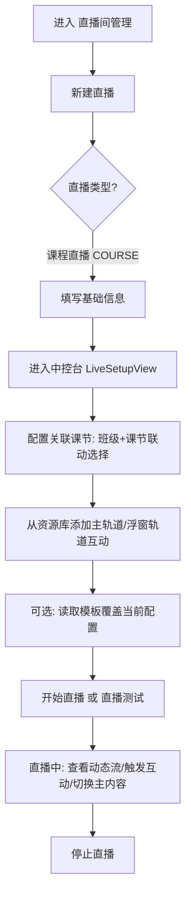
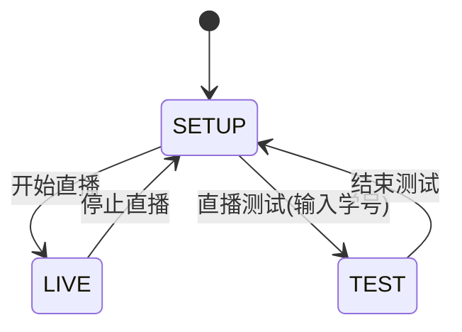
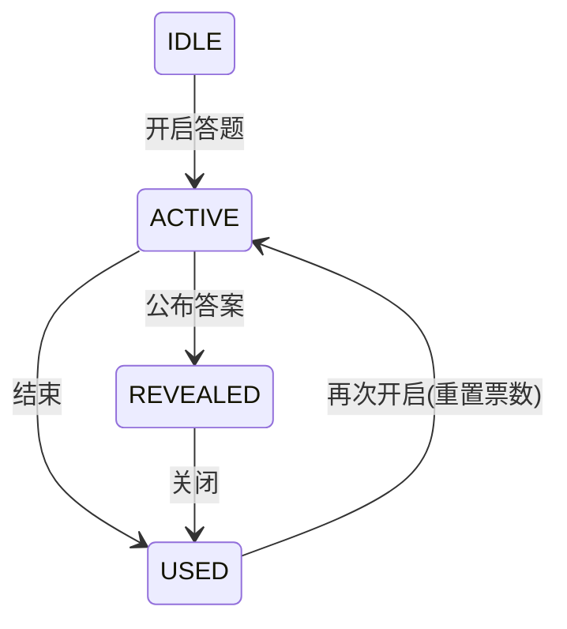

## 直播管理系统（交互直播中控台）产品需求文档（PRD 详细版）

**项目代号**：交互直播 2.0  
**项目形态**：B 端 Web 中控台（老师/导播使用）  
**当前实现状态**：本地优先（IndexedDB/Dexie）+ 大量 Mock（用于 Demo 与快速迭代）  
**文档版本**：V2.0（面向“新同学快速上手”）  
**面向对象**：产品 / 前端 / 后端 / QA / 交付运维  
**最后更新**：2026-01-07  

---

## 0. 阅读指南（给第一次接触项目的开发）

如果你要在 30 分钟内快速上手，请按这个顺序理解：

- **先理解四个概念**：资源（Resource）→ 模板（Template）→ 直播间配置（ConfiguredInteractions）→ 中控台（LiveSetupView）。
- **再理解两条轨道**：主轨道 MAIN（独占）/ 浮窗轨道 OVERLAY（并行、可绑定 parentId）。
- **最后理解运行态**：每个互动卡片都有明确状态机（例如答题：IDLE/ACTIVE/REVEALED/USED）。

这份 PRD 会把“页面、模块、字段、状态、流程、异常、数据结构”都讲清楚，让没接触过项目的开发能直接开干。

---

## 1. 背景与目标

### 1.1 背景（Why now）
教育直播与泛娱乐直播不同，核心诉求是：

- **流程可控**：老师需要明确的“流程编排与执行面板”，而不是到处切网页/切工具。
- **互动密度高**：一节课往往需要多次互动（答题、投票、讨论、辩论、闯关等），且互动需要快速触发与结束。
- **可复用**：一套优秀的互动课流程应当可以沉淀为模板复用，降低备课成本。

传统做法通常是“OBS + 多个网页/小工具 + 人工切换”，导播/老师操作成本很高且易出错。本项目希望把核心能力收敛到一个网页端中控台中。

### 1.2 产品目标（What）
- **降低直播操作复杂度**：将“编排 + 触发 + 监看 +（未来）OBS 控制”集成在一处。
- **提升互动丰富度**：提供多种互动卡片，覆盖教学常用玩法。
- **提升复用能力**：资源库沉淀可复用积木；模板库沉淀可复用流程。
- **支持快速迭代**：本地优先存储 + Mock 数据，保证无后端也能跑通主链路。

### 1.3 非目标（Not in scope）
当前版本不强制交付（但文档会给出演进建议）：

- 学生端真实接入（当前学生动态流为 Mock）
- 真正的推流链路、房间鉴权与权限体系（当前为单机演示）
- 与 OBS WebSocket 的真实通信（当前为 Mock 连接与 Mock 场景树）
- 资源素材的真实上传与存储（图片/音频/模型文件多为 UI 占位）

---

## 2. 名词解释与核心概念

### 2.1 核心对象（与 `types.ts` 对齐）
- **直播间（LiveStream）**：一场直播的元数据 + 互动配置（`configuredInteractions`）。
- **交互资源（InteractiveResource）**：可复用的互动积木（静态资产）。
- **交互模板（InteractionTemplate）**：把多个资源/实例编排成一套流程（可复用资产）。
- **交互实例（InteractionItem）**：资源/模板在“直播间”或“模板编辑器”里实例化后的条目（运行资产）。

### 2.2 直播类型（LiveType）
- `COURSE`：课程直播（强调“关联课节/班级”）
- `ORDINARY`：普通直播（强调“可见人群 + 分场次”）

### 2.3 轨道（TrackType）与父子关系（parentId）
系统内将互动区分为两条轨道：

- **主轨道（MAIN）**
  - 含义：强干扰、主内容，往往接管主屏幕（如切片课、视频、Gandi/外链作为主展示）。
  - 策略：**独占**（同一时间仅允许 1 个主轨道内容为 Active）
  - 关键状态：`activeMainTrackId`（当前正在播的主内容）、`completedMainTrackIds`（播完历史）

- **浮窗轨道（OVERLAY）**
  - 含义：弱干扰、叠加卡片（答题、投票、辩论、一站到底、AI 开关、模型等）。
  - 策略：**并行**（可同时存在多个）
  - 关系：overlay 可设置 `parentId` 指向某个主轨道实例，用于“随主内容联动/分组管理”（当前代码已写入该字段，联动策略为未来可扩展）。

### 2.4 触发模式（TriggerMode）
- `MANUAL`：手动触发（当前主要使用）
- `AUTO_TIME`：到点自动触发（当前已有简化定时器引擎）
- `AUTO_END`：随父级结束自动关闭（预留字段，后续可落地）

---

## 3. 用户角色与权限（产品定义）

### 3.1 角色
- **超级管理员/导播**
  - 创建/编辑直播间
  - 管理资源库与模板库
  - 配置并操作 OBS 场景（当前为 Mock）
  - 直播中统一操作（切换主内容、触发互动、监控动态）

- **讲师/老师**
  - 在直播中控台执行流程：开启/结束互动卡片
  - 查看学生动态流（当前为 Mock）

### 3.2 权限建议（后续接入后端时）
当前代码没有账号体系，后续建议：

- 直播间：仅创建者/授权者可进入中控台
- 资源/模板：按组织隔离；支持共享与私有
- OBS 密码：不落盘或加密存储；有权限审计
- 测试学号：属于敏感配置，需权限控制与审计

---

## 4. 信息架构与页面结构

### 4.1 顶层信息架构（与 `App.tsx` 一致）



### 4.2 直播中控台三栏架构（与 `LiveSetupView.tsx` 一致）

```mermaid
graph LR
  A[LiveSetupView] --> L[左栏]
  A --> M[中栏]
  A --> R[右栏]

  L --> L1[SETUP: 基础信息/可见人群/分场次]
  L --> L2[LIVE: 学生动态流 StudentTimeStream(MOCK)]

  M --> M1[画面回显 getUserMedia + 音量条]
  M --> M2[设备控制 LiveControlPanel]
  M --> M3[OBS 控制 ObsControlPanel(MOCK)]

  R --> R1[功能开关: 弹幕/IM/战队/弱化背景音]
  R --> R2[交互列表: 按类型分组展示 Card]
  R --> R3[模板动作: 读取/保存/另存为/清空]
```

---

## 5. 数据模型与存储设计（Dexie / IndexedDB）

### 5.1 存储策略
当前版本将核心数据写入浏览器 IndexedDB（Dexie），具备以下特性：

- 页面刷新不丢数据（适合 Demo/断网演示）
- 无后端也可跑通 CRUD
- 代价是多端不一致，需要后续接入服务端作为真源

### 5.2 Dexie 表结构（与 `services/db.ts` 一致）
- `streams`：主键 `id`（字符串）
- `resources`：主键 `id`，索引 `category`
- `templates`：主键 `id`

### 5.3 核心 TypeScript 类型（与 `types.ts` 一致）

#### 5.3.1 LiveStream（直播间）
- `id: string`
- `name: string`
- `description: string`
- `coverUrl: string`
- `type: LiveType`
- `teacher: string`
- `status: LiveStatus`
- `startTime?: string`
- `sessions?: LiveSession[]`
- `configuredInteractions?: InteractionItem[]`

#### 5.3.2 InteractiveResource（交互资源）
- `id/name/category/templateName/creator/modifiedAt/labels`
- `config?: any`：具体配置由 `category` 决定

#### 5.3.3 InteractionTemplate（交互模板）
- `id/name/labels/interactionCount/creator/modifiedAt/items?`

#### 5.3.4 InteractionItem（交互实例）
- `id/title/type/time/label/resourceId?/config?`
- `track: 'MAIN' | 'OVERLAY'`
- `triggerMode: 'MANUAL' | 'AUTO_TIME' | 'AUTO_END'`
- `duration?: number`
- `parentId?: string`
- `autoClose?: boolean`

---

## 6. 关键用户旅程（User Journey）

### 6.1 旅程 A：从 0 到 1 开一场课程直播



### 6.2 旅程 B：沉淀资产（资源/模板）并复用

```mermaid
flowchart TD
  A[进入 交互资源库] --> B[新建资源]
  B --> C[选择类型并填写配置]
  C --> D[保存资源(IndexedDB)]
  D --> E[进入 交互模板库]
  E --> F[新建模板]
  F --> G[从资源库选择资源加入模板]
  G --> H[拖拽排序/编辑备注/设置时间点]
  H --> I[保存模板(IndexedDB)]
  I --> J[在直播中控台读取模板复用]
```

---

## 7. 功能需求（按模块拆解）

## 7.1 全局框架（App / Sidebar / Header）

### 7.1.1 Sidebar（侧边栏）
- **入口**：
  - 直播间管理
  - 交互资源库
  - 交互模板库
- **要求**：
  - 视图切换不影响数据（数据均来自 Dexie）
  - 视觉层保持简洁明确（后台工作台风格）

### 7.1.2 Header（顶部栏）
- **功能**：
  - 折叠/展开侧边栏
  - 显示当前位置（面包屑）

---

## 7.2 直播间管理模块（Room Management）

### 7.2.1 直播列表（`LiveStreamList.tsx`）
- **数据源**：`db.streams.toArray()`（Dexie LiveQuery）
- **Tab**：
  - 全部
  - 我直播过（当前实现为演示逻辑：stream.id 包含特定字串）
- **筛选字段**：
  - 直播间名称（模糊）
  - 直播间 ID（模糊）
  - 主播/老师（模糊）
  - 直播类型（课程/普通）
- **主要操作**：
  - 新建直播（打开创建弹窗）
  - 点击卡片进入中控台（进入该直播的配置/运行页）

### 7.2.2 新建/编辑直播（`CreateLiveModal.tsx`）
> 这是“创建直播间元数据”的入口，决定直播类型与基础信息。

- **公共字段**：
  - 直播名称、描述、封面 URL、老师/主播、开始时间
- **直播类型差异**：
  - `COURSE`：强调“课节关联”（中控台左侧通过联动选择器配置）
  - `ORDINARY`：强调“可见人群 + 分场次”（中控台左侧配置）
- **普通直播分场次 Sessions**：
  - 支持增删改：`id/name/hostName/coverUrl?/startTime`
  - 需求侧解释：用于描述直播内部子环节（如开场/颁奖/抽奖等）

### 7.2.3 持久化要求
- 新建：写入 `db.streams.add(stream)`
- 编辑：写入 `db.streams.update(stream.id, fields...)`
- 进入中控台后，`configuredInteractions` 会自动保存（见 7.5.7）

---

## 7.3 交互资源库模块（Resource Library）

### 7.3.1 资源列表（`InteractiveResourceList.tsx`）
- **筛选条件**：
  - ID、名称、类别、标签（多选）
- **展示字段**：
  - 交互名称、类别、标签、创建人、修改时间、操作（编辑/删除）
- **操作**：
  - 新建资源
  - 编辑资源
  - 删除资源（建议二次确认）

### 7.3.2 资源编辑器（`CreateInteractiveResourceView.tsx`）

#### 7.3.2.1 通用信息模块
- **资源名称**：必填
- **标签**：多选；支持自定义新增标签
- **类型选择**：新建时可选；编辑时锁定（避免类型切换造成 config 结构不一致）

#### 7.3.2.2 校验规则（必须满足才能保存）
- `resourceName` 非空
- 不同类型字段按下述 Schema 校验（例如答题必须有选项、必须选正确答案）

#### 7.3.2.3 资源类型与 Config Schema（开发对齐用）
> `config` 在代码中是 `any`，但业务上应形成“准 schema”，方便后端/学生端对齐。

- **答题（QUIZ）**
  - 必填：`topic`、`options[].name`、`correctAnswer`
  - 结构：
    - `topic: string`
    - `isSingle: boolean`
    - `options: { id: string, name: string, desc?: string, img?: any }[]`
    - `correctAnswer: string`（1-based）
    - `analysis?: string`
    - `rewardScore?: string|number`
    - `deductScore?: string|number`

- **投票（VOTE）**
  - 必填：`name`、`options[].name`
  - 结构：
    - `name: string`
    - `desc?: string`
    - `isSingle: boolean`
    - `options: { id: string, name: string, desc?: string, img?: any }[]`
    - `correctOption?: string`
    - `rewardScore?: string|number`
    - `wrongReward?: string|number`

- **辩论（DEBATE）**
  - 必填：`title`、`pro.view`、`con.view`
  - 结构：
    - `title: string`
    - `pro: { view: string, img?: any }`
    - `con: { view: string, img?: any }`

- **主题讨论（DISCUSSION）**
  - 必填：`topic`、`desc`
  - 结构：
    - `topic: string`
    - `desc: string`
    - `totalTime?: string|number`（分钟）
    - `perPersonTime?: string|number`（秒）
    - `reward?: string|number`
    - `bgImg?: any`（占位）
    - `hostVoice?: any`（占位）

- **模型（MODEL）**
  - 必填：`name`、`url`
  - 结构：
    - `name: string`
    - `url: string`
    - `jsonConfig?: any`

- **Gandi 内嵌（GANDI_EMBED）**
  - 必填：`name`、`projectId`
  - 结构：
    - `name: string`
    - `projectId: string`

- **外链（LINK）**
  - 必填：`name`、`url`
  - 结构：
    - `name: string`
    - `url: string`

- **一站到底（ONE_STAND）**
  - 必填：`topic`、`questions[].topic`、`questions[].options[].name`、`questions[].correct`
  - 结构：
    - `topic: string`
    - `mode: '错误淘汰' | '最大错误数'`
    - `maxErrors?: string|number`
    - `questions: { id, topic, analysis?, isSingle, options, correct, score?, deduct? }[]`

- **切片课资源（COURSE_SLICE）**
  - 必填：`lessonName`、`version`
  - 结构：
    - `lessonName: string`
    - `version: string`
    - `slices?: { id, type, title, duration }[]`（保存时会注入 Mock 切片）
  - 关键说明：
    - 这是一个“容器资源”，在添加到直播/模板时会按 slices 展示与过滤（例如“仅加作业”）

- **AI 开关（AI_SWITCH）**
  - 资源库编辑页**不提供**该类别创建（系统组件）。
  - 在资源选择弹窗会注入虚拟资源（见 7.5.4）。

---

## 7.4 交互模板库模块（Templates）

### 7.4.1 模板列表（`InteractionTemplateList.tsx`）
- **筛选**：名称、ID、创建人、标签（多选）
- **展示字段**：名称、标签、交互数量、创建人、修改时间
- **操作**：新建/编辑/删除（删除建议二次确认）

### 7.4.2 模板编辑器（`EditInteractionTemplateView.tsx`）
- **模板信息模块**：
  - 模板名称（必填）
  - 模板标签（来自统一标签源 `COMMON_LABELS`）
- **交互配置模块**：
  - 通过 `ResourceSelectionModal` 从资源库选择资源加入模板
  - 支持删除
  - 支持拖拽排序（列表与时间线视图均支持拖拽概念）
  - 每个 item 支持编辑 `time`、`label`（部分 UI 在时间线视图表现更明显）
- **保存行为**：
  - 生成/复用 `template.id`
  - `interactionCount = items.length`
  - 写入 Dexie：`db.templates.put(...)`（由 App 层统一）

---

## 7.5 直播中控台模块（LiveSetupView：配置与运行统一入口）

### 7.5.1 模式：SETUP / LIVE / TEST
- **SETUP（开播前）**：
  - 左侧：直播基础信息/可见人群/分场次
  - 右侧：交互列表 + 模板操作 + 添加/清空
- **LIVE（直播中）**：
  - 顶部显示 On Air 样式
  - 左侧切换为学生动态流（Mock）
- **TEST（测试直播）**：
  - 输入测试学号（文本域）
  - UI 强提示“仅指定账号可见”



### 7.5.2 三栏布局（`ResizableLayout`）
- 左/中/右栏可拖拽调整宽度
- 约束：每栏最小宽度 15%（同时也有 min-w 像素级兜底）

### 7.5.3 左栏：基础信息 / 可见人群 / 分场次 / 动态流

- **基础信息**：
  - 展示直播名称、描述、类型
  - 支持点击“编辑信息”打开直播编辑弹窗

- **普通直播分场次（仅 ORDINARY）**：
  - `LiveSessionList` 支持新增/删除/更新
  - 产品侧建议：后续可将分场次与模板章节关联，实现“章节一键切换”

- **可见人群配置**
  - 课程直播：联动选择器（班级 + 课节）
  - 普通直播：4 种模式 Tab
    - 按班级（多选搜索）
    - 按课程（多选搜索）
    - 按用户类型（多选搜索）
    - 按学号（文本域，Excel 上传/模板下载为占位）

- **直播中动态流（LIVE/TEST）**
  - 使用 `StudentTimeStream`（Mock），每 2 秒随机产生事件
  - 支持筛选：事件类型、战队、姓名/学号搜索

### 7.5.4 中栏：画面回显 / 设备控制 / OBS 控制

#### 7.5.4.1 画面回显（Monitor）
- 通过 `getUserMedia` 获取音视频
- 通过 `AudioContext` 计算音频能量并渲染音量条
- 权限/设备异常时给出明确提示
- 当存在 `activeMainTrackId` 且主内容不是摄像头画面时，会显示“非摄像头内容正在展示”的遮罩（模拟主内容接管）

#### 7.5.4.2 设备控制（LiveControlPanel）
- 选择音频源/视频源（UI 演示）
- 麦克风静音/摄像头关闭（UI 状态）
- 切入模式：全屏切入 / 画中画切入（UI 演示）

#### 7.5.4.3 OBS 控制（ObsControlPanel）
当前为 Mock，但 UI 结构已经能承载真实接入：

- 连接配置：IP/端口/密码
- 连接状态：连接中/已连接/断开
- 场景树：场景 → Sources（带 PGM 标识）
- 切换场景：点击“切换”更新 programScene
- 布局预览：根据 transform 数据在 16:9 画布绘制线框

### 7.5.5 右栏：功能开关 / 交互列表 / 模板管理

#### 7.5.5.1 功能开关（Live Functions）
- 弹幕（danmaku）
- 弱化背景音（weakenBackgroundAudio，作为弹幕子开关）
- IM（im）
- 战队（team）

#### 7.5.5.2 交互列表（按类型分组）
- 展示策略：按 `InteractionCategory` 分组
- 卡片由父组件维护运行态（status/votes/isExpanded），并传递给各 Card
- 空态：提示“暂无交互配置”

#### 7.5.5.3 模板操作（仅 SETUP 可用）
- 读取模板（FolderOpen）
- 保存模板（Save，仅当已加载模板时显示）
- 另存为模板（Copy）
- 清空（Trash）

### 7.5.6 资源选择弹窗（`ResourceSelectionModal`）
- 筛选：名称、类别、标签（多选 + 搜索）
- 会从 resources 自动聚合出所有标签集合（ALL_LABELS）
- 特殊逻辑：
  - **注入虚拟 AI 开关资源**：若允许 AI_SWITCH，会在列表顶部插入 `SYS_AI_SWITCH`
  - **切片课按钮**：支持“添加全部”与“仅加作业”（通过 `_mode` 过滤 slices）

### 7.5.7 交互实例化与轨道策略

#### 7.5.7.1 轨道判定（与代码一致）
- 主轨道类别集合（MAIN_CATEGORIES）：
  - `COURSE_SLICE` / `VIDEO` / `GANDI_EMBED` / `LINK`
- 其他类别默认走 OVERLAY

#### 7.5.7.2 新增交互实例（Resource -> InteractionItem）
通用规则：

- 生成新的 `id`（避免冲突）
- `resourceId = resource.id`
- `title = resource.name`
- `type = resource.category`
- `config = resource.config`（复制）
- `triggerMode` 默认 `MANUAL`

Overlay 的 parentId：
- 若当前存在 `selectedMainTrackId`，则 overlay 默认绑定 `parentId = selectedMainTrackId`

切片课特殊规则：
- 若 `resource.category === COURSE_SLICE && resource.config.slices`，添加时会保留/过滤 slices 并生成一个主轨道实例

AI 开关特殊规则：
- 中控台可直接添加 AI_SWITCH 实例，无需资源选择（系统组件）

#### 7.5.7.3 主轨道的独占控制
- `handleStartMainItem(id)`：
  - 若已有 activeMainTrackId 且不同于 id：将旧 active 记为 completed
  - 设置 `activeMainTrackId = id`
  - 同步设置 `selectedMainTrackId = id`（便于右侧展示相关 overlay）

### 7.5.8 自动触发引擎（AUTO_TIME）
中控台已实现一个简化版定时器引擎：

- `currentTime` 每秒 +1（当 isPlaying 为 true）
- 当到达某个 item 的触发时间且 `triggerMode === AUTO_TIME` 时：
  - Quiz/Vote → ACTIVE
  - Debate → PHASE1
  - 仅当当前状态为 IDLE 才触发（避免重复触发）

后续演进建议：
- 暴露 isPlaying 开关与当前时间轴 UI
- 引入统一“互动开始/结束事件”，支持回放与审计

---

## 7.6 互动卡片模块（运行态与状态机）

### 7.6.1 通用约定
- 卡片通用能力：
  - 展开/收起
  - 运行态 badge（未开启/进行中/已结束等）
  - 操作按钮（开始/公布/结束/重开）
  - 删除（非只读模式）
- 运行态管理：
  - 绝大多数卡片：由父组件维护 status/votes/isExpanded
  - 一站到底：题目内部阶段（ANSWERING/REVEALED/RESULT）由卡片内部维护

### 7.6.2 答题（`QuizCard`）
- **状态机**：`IDLE -> ACTIVE -> REVEALED -> USED`（USED 可再次开启）
- **关键动作**：
  - 开启答题：进入 ACTIVE 且自动展开
  - ACTIVE：模拟投票增长
  - 公布答案：进入 REVEALED 并高亮正确项
  - 结束/关闭：进入 USED 并收起
  - 再次开启：重置票数并回到 ACTIVE



### 7.6.3 投票（`VoteCard`）
- **状态机**：`IDLE -> ACTIVE -> USED`（USED 可重新投票）
- ACTIVE：模拟投票增长并展示柱状/比例
- USED：保留结果分布（用于复盘）

### 7.6.4 辩论（`DebateCard`）
- **状态机**：`IDLE -> PHASE1 -> PHASE2 -> PHASE3 -> USED`
  - PHASE1：投票阶段
  - PHASE2：辩论中（支持开关：允许持续投票/主屏显示投票页/展示阶段结果）
  - PHASE3：结算阶段（展示拉票榜 MVP，可选择某用户“全屏展示”）
  - USED：结束，可重新开始

### 7.6.5 一站到底（`EliminationCard`）
- **外层状态机**：`IDLE -> ACTIVE -> USED`
- **内部题目阶段**：`ANSWERING -> REVEALED -> RESULT`
- **关键指标**：
  - 幸存人数/淘汰人数（模拟）
  - 当前题号 Qx/N
- **关键动作**：
  - 公布答案 → 揭晓结果 → 下一题/结束全部 → USED

### 7.6.6 AI 开关（`AISwitchCard`）
- **状态机**：`IDLE <-> ACTIVE`（可反复开关）
- **配置项**：
  - agentId（智能体选择，Mock 列表）
  - displayMode（LARGE/SMALL/IP）
- **业务定位**：
  - 系统能力开关：用于控制学生端/讲师端 AI 助教能力是否启用（后续可接入真实服务）

### 7.6.7 其他卡片（概述）
以下卡片采用统一的简化运行态：`IDLE | ACTIVE | USED`

- GandiCard：进入协作项目（演示）
- LinkCard：外链展示与跳转（演示）
- ModelCard：3D 模型展示（演示）
- SliceListCard：切片列表（演示，通常属于主轨道）

---

## 7.7 模板与直播配置关系（覆盖/保存/另存为）

### 7.7.1 读取模板（覆盖当前配置）
需求要求：
- 必须二次确认（覆盖当前所有配置）
- 必须做 ID 重映射，避免实例冲突
- 必须同步重写 parentId，保证绑定关系不丢失

```mermaid
flowchart TD
  A[点击: 读取模板] --> B[选择模板]
  B --> C{确认覆盖?}
  C -->|否| D[取消]
  C -->|是| E[生成 idMap old->new]
  E --> F[替换 item.id 与 item.parentId]
  F --> G[setInteractionsList(newItems)]
  G --> H[记录 currentTemplateId/name]
```

### 7.7.2 保存模板（覆盖已加载模板）
仅当已加载模板（currentTemplateId 存在）才允许“保存模板”：
- 二次确认（提示影响范围）
- 写入：items/interactionCount/modifiedAt

### 7.7.3 另存为模板
- 打开 `SaveTemplateModal`
- 输入模板名称（必填）
- 选择/输入标签
- 保存生成新模板 ID，并将其设为当前模板

### 7.7.4 清空交互
- 二次确认后：
  - interactionsList 清空
  - interactionStates 清空
  - selectedMainTrackId/activeMainTrackId 清空
  - currentTemplateId/currentTemplateName 清空

---

## 8. 异常与边界条件

### 8.1 媒体设备权限异常
- 权限拒绝：提示“摄像头或麦克风权限被拒绝”
- 无设备：提示“未检测到摄像头或麦克风设备”
- 其他异常：提示“媒体设备初始化失败”

### 8.2 模板加载异常
- 模板缺少 items：提示“模板数据不完整（缺少 items 配置）”

### 8.3 本地数据一致性与重置
- IndexedDB 是“本机浏览器维度”的存储，多端不一致属于预期
- 若要重置：清除浏览器站点数据/IndexedDB（建议后续提供开发入口按钮）

---

## 9. 非功能需求（NFR）

### 9.1 性能
- 资源/模板/直播间列表需支持 500+ 规模可用（后续考虑分页或虚拟列表）
- 中控台交互列表分组渲染需避免频繁无意义渲染（后续可引入 memo/分片）

### 9.2 可靠性
- OBS 真接入后必须：连接失败/断线不崩溃，给出明确提示并支持重连
- 动态流真接入后必须：断线重连、消息去重/顺序策略

### 9.3 安全
- OBS 密码属于敏感信息：不落盘或加密存储
- 学号白名单/测试账号属于敏感配置：需权限控制与审计

### 9.4 可维护性
- `types.ts` 为数据契约单一事实来源
- Dexie schema 变更需考虑迁移版本（this.version(n).stores(...)）

---

## 10. 技术栈与工程约定

### 10.1 技术栈
- React + TypeScript + Vite
- Dexie + dexie-react-hooks
- Lucide React

### 10.2 关键目录（快速定位）
```
/components
  LiveStreamList.tsx                 # 直播间列表
  LiveSetupView.tsx                  # 中控台核心
  CreateLiveModal.tsx                # 新建/编辑直播
  InteractiveResourceList.tsx        # 资源库列表
  CreateInteractiveResourceView.tsx  # 资源编辑器
  InteractionTemplateList.tsx        # 模板库列表
  EditInteractionTemplateView.tsx    # 模板编辑器
  LiveSetupComponents.tsx            # 中控台通用组件/弹窗/三栏布局
  LiveStreamControls.tsx             # 设备控制 + OBS 控制（Mock）
  *Card.tsx                          # 各类互动卡片
/services/db.ts                      # Dexie DB + 初始化 Mock 数据
/types.ts                            # 全局类型定义（强契约）
```

---

## 11. 演进路线建议（Roadmap）
- **后端接入**：streams/resources/templates 的服务端 CRUD；Dexie 变为缓存层
- **学生端接入**：动态流 WebSocket 真消息；互动结果回传与统计
- **OBS 真连接**：接入 obs-websocket v5，落地场景切换/来源启停/截图预览
- **素材上传与 CDN**：图片/音频/模型/JSON 配置文件
- **自动编排与回放**：完善 AUTO_TIME/AUTO_END，支持回放与审计日志

---

## 12. FAQ（新人常问）

### 12.1 为什么刷新页面数据还在？
因为数据存储在浏览器 IndexedDB（Dexie）。如需清空请清除站点数据/存储。

### 12.2 能否直接接入真实后端？
可以。建议以 `types.ts` 为契约，先补齐后端 CRUD，再逐步替换 Dexie 写入逻辑。


